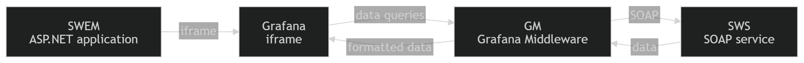
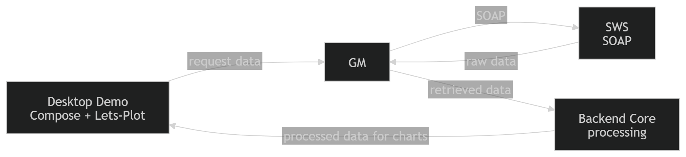
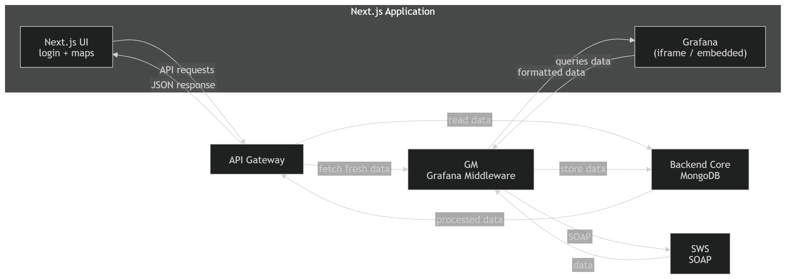

# System Architecture

## Overview

The system is designed as a modular, service-oriented architecture that integrates with an external SOAP-based system (SWS), processes data, and exposes it to multiple clients (Grafana, web application, desktop application).

The architecture separates responsibilities across multiple services to ensure scalability, maintainability, and clear data flow.

>Eltratec

The Eltratec architecture shows integration with an existing ASP.NET system and Grafana visualization.

>Sensum

The Sensum architecture represents the newly developed system with API Gateway, Backend Core, and multiple clients.
---

## High-Level Architecture

The system consists of the following main components:

- **GM (Grafana Middleware)** – integration layer between SWS and visualization tools
- **Backend Core** – data processing and persistence layer
- **API Gateway** – REST API layer for frontend applications
- **Desktop Application** – data visualization client
- **SWS (Smart Web Service)** – external SOAP service

---

## Component Description

### GM (Grafana Middleware)

The GM is responsible for communication with the external SWS system.

Responsibilities:

- Authenticate users via SWS
- Manage SWS sessions (cookies)
- Fetch data from SWS
- Transform data into a format suitable for internal use
- Provide data for Grafana and other services

---

### Backend Core

The Backend Core is responsible for data storage and processing.

Responsibilities:

- Store data in **MongoDB**
- Process and aggregate measurement data
- Provide structured data for API Gateway
- Serve as the main data source for the system

---

### API Gateway

The API Gateway exposes REST endpoints for client applications.

Responsibilities:

- Provide a unified REST API
- Handle requests from frontend applications (Next.js)
- Forward requests to Backend Core
- Handle authentication (token-based)
- Return JSON responses

---

### Desktop Application

The desktop application is used for advanced data visualization.

Responsibilities:

- Display measurement data using **Lets-Plot**
- Provide interactive data exploration (player)
- Fetch data from API Gateway

---

### SWS (External Service)

SWS is an external SOAP-based system.

Responsibilities:

- Validate user credentials
- Provide measurement data
- Maintain session via cookies

---

## Architectural Layers

### 1. Client Layer

- Next.js web application
- Desktop application (Compose + Lets-Plot)
- Grafana dashboards

---

### 2. API Layer

- API Gateway
- REST endpoints
- JSON communication

---

### 3. Application Layer

- Backend Core
- Business logic and data processing

---

### 4. Integration Layer

- GM (Grafana Middleware)
- SOAP communication with SWS

---

### 5. External Layer

- SWS (SOAP service)

---

## Data Flow

### Authentication Flow

1. Client sends login request to API Gateway or GM
2. GM sends SOAP request to SWS
3. SWS returns login result and session cookie
4. GM stores session and returns token
5. Token is used for subsequent requests

---

### Data Retrieval Flow

1. Client requests data via API Gateway
2. API Gateway requests data from Backend Core
3. Backend Core:
    - retrieves stored data (MongoDB) OR
    - requests fresh data from GM

4. GM fetches data from SWS (SOAP)
5. Data flows back:
    - SWS → GM → Backend Core → API Gateway → Client

---

## Communication

### Internal Communication

- REST (JSON over HTTP)
- Token-based authentication

---

### External Communication

- SOAP (XML over HTTP)
- Cookie-based session management

---

## Design Decisions

- **Modular architecture**  
  Each component has a clearly defined responsibility

- **Separation of concerns**  
  Data fetching, processing, and exposure are separated

- **Hybrid data approach**  
  Data can be fetched live from SWS or stored in MongoDB

- **External authentication**  
  Authentication is delegated to SWS

- **Multiple clients support**  
  System supports Grafana, web, and desktop clients

---

## Future Improvements

- Persistent session storage (database instead of memory)
- Caching layer for SWS responses
- Improved error handling and retries
- Monitoring and observability (Grafana, logging)
- Deployment with containerization (Docker)